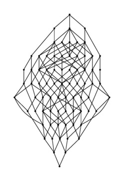
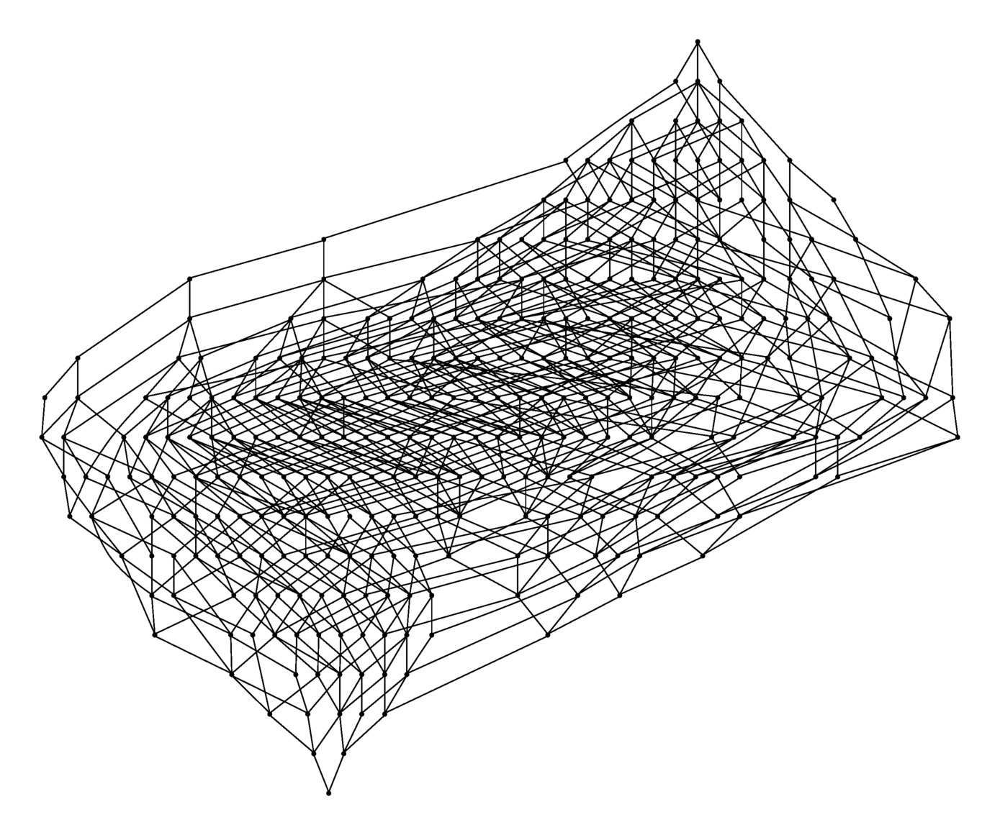
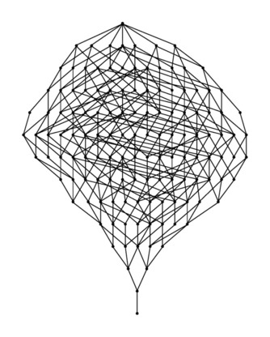
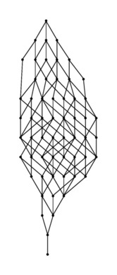
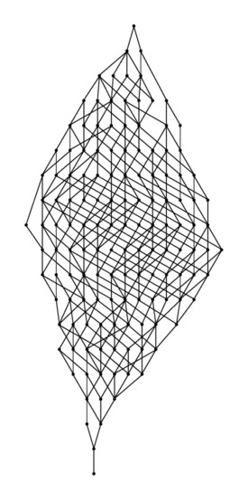
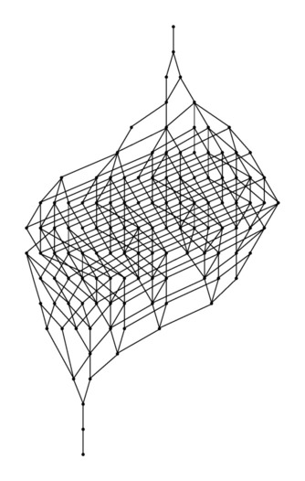
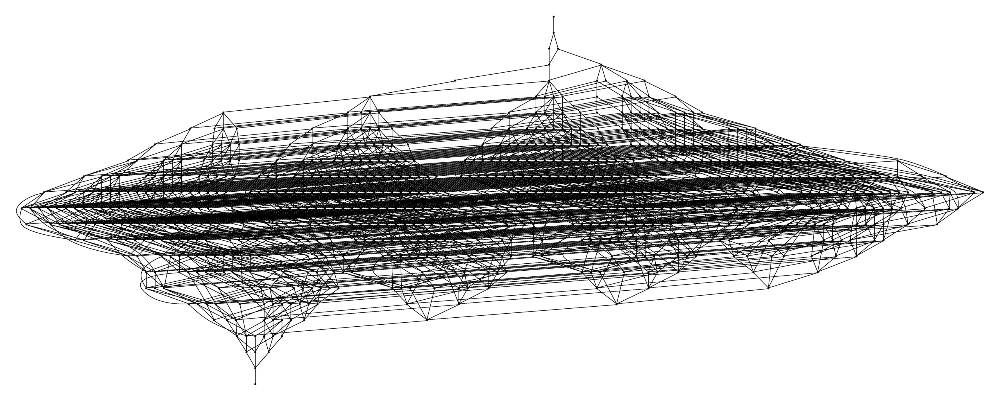
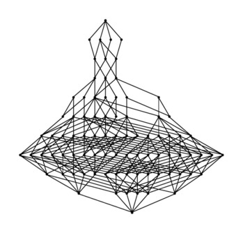
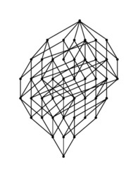

James East asked for some pictures of some congruences lattices of some famous
semigroups, and I thought I'd post them here. 

The pictures in this post were created using the 
[Semigroups package for GAP](https://gap-packages.github.io/Semigroups/)
(the development version). The particular code for finding congruence lattices
was written by Michael Torpey and me. 
Given a finite semigroup *S* and a set *P* of pairs of elements of *S*, the 
[Semigroups package](https://gap-packages.github.io/Semigroups/) finds a
presentation *<A|R>* for *S* using a version of the 
[Froidure-Pin algorithm](https://www.irif.fr/~jep/PDF/Rio.pdf) algorithm, and
then runs the [Todd-Coxeter procedure](https://en.wikipedia.org/wiki/Todd–Coxeter_algorithm) on the presentation *<A|R,P>*.

# Transformation semigroups

Perhaps the most famous transformation semigroups are the full transformation
monoid, the partial transformation monoid, and the symmetric inverse monoid.
The congruences lattices of these three monoids are all chains, described
many years ago by Libor and Mal'cev. 

In a recent paper of [Araujo, Bentz, and Gomes](https://arxiv.org/abs/1602.06339), 
the congruences of direct products of
the full transformation monoid \\(T_n\\), \\(n\in\mathbb{N}\\), were described.
Here are the congruence lattices \\(T_2 \times T_2\\) and \\(T_2 \times T_3\\):

 

 

The *Catalan monoid* \\(C_n\\) consists of those order-preserving and
decreasing transformations \\(f\\) of degree \\(n\\). The congruence lattice of
\\(C_4\\) looks like this:

 

The transformations preserving a partition *P* of \\(\{1, \ldots, n\}\\) form a
monoid; let's denote it by \\(T(P)\\). 
In a [recent paper](https://arxiv.org/abs/1404.1598) with Joao Araujo, Wolfram
Bentz, and Csaba Schneider, we determined the minimum size of a generating set
for \\(T(P)\\). Here are the congruence lattices of \\(T(1 + 2)\\) and \\(T(2 +
  2)\\):

  
   

# Semigroups of binary relations (or Boolean matrices)

Perhaps the most famous semigroup of Boolean matrices is the one containing all
of the Boolean matrices, called the *full Boolean matrix monoid* and denote
\\(\mathbf{B}_n\\) where \\(n\in\mathbb{N}\\) is the dimension of the matrices. The
congruences of this semigroup are not known, which is perhaps not surprising
since many more elementary things are not known about \\(\mathbf{B}_n\\) such as the
minimum number of matrices required to generate it, the number of its Green's
\\(\mathscr{J}\\)-classes and so on. 

Here is the lattice of congruences of
\\(\mathbf{B}_3\\):

  

There are some more semigroups of Boolean matrices which we might consider
famous because of their connects to famous problems in other areas. 

## The Hall monoids

The *Hall monoid* is the monoid consisting of all solutions to [Hall's
Marriage Problem](https://en.wikipedia.org/wiki/Hall's_marriage_theorem):

**Hall's Marriage Problem.**
Given two groups \\(A\\) and \\(B\\) of people:

* for every person \\(a\\) in \\(A\\) there is a subset \\(B_a\subseteq B\\)
  such that \\(a\\) would be happy to marry anyone in \\(B_a\\); and

* every person in \\(B\\) is happy to marry anyone who wants to marry them.

Is it possible to marry everyone so that everyone is happy?

**Hall's Marriage Theorem. [Hall 1935]**
Everyone is happy if and only if for any subset \\(W\\) of \\(\\{B_a : a\in
A\\}\\),
$$|W| \leq \left|\bigcup_{B_a\in W}B_a\right|.$$

For example, if \\(A = \{1,2,3\}\\) and \\(B = \{1,2,3,4,5\}\\), and 
\\(B_1 = \{1, 2, 3\}\\), \\(B_2 = \{1, 4, 5\}\\), \\(B_3 = \{3, 5\}\\),
then possible "marriages" are 
\\((1, 1), (2, 4), (3, 5)\\) and \\((1, 2), (2, 1), (3, 3)\\).

But if 
\\(B_1 =  \{2, 3, 4, 5\}\\),  \\(B_2 = \{4, 5\}\\),   \\(B_3 = \{5\}, \quad B_4
= \{4\}\\),
then there are no possible "marriages" since if \\(W = \{B_2, B_3, B_4\}\\),
then 
$$|W| = 3 > \left|\bigcup_{i = 2}^{4}B_i\right| = |\{4,5\}| = 2.$$

Suppose that
$$B_1 = \{1, 2, 3\},\quad B_2 = \{2, 4\},
  \quad B_3 = \{1, 2, 4\},\quad B_4 = \{2, 4\}.$$
Then this can be described by a Boolean matrix where row \\(i\\) is the
"characteristic" function of \\(B_i\\): 

  $$
  \begin{pmatrix}
    1              & 1            & 1 & 0            \\
    0              & 1 & 0        & 1 \\
    1 & 1            & 0              & 1            \\
    0              & 1 & 0              & 1
  \end{pmatrix}
  $$
  
 
and "marriages'' become permutation matrices contained this matrix. 

We say that such a matrix is a *Hall matrix* if it contains a
permutation matrix, and let \\(\mathbf{H}_{n}\\) denote the monoid of
consisting of all Hall matrices of dimension \\(n\\).

The number of Hall matrices, or the size of the Hall monoid \\(\mathbf{H}_n\\)
for some small values of \\(n\\) can be found on
the [OEIS](https://oeis.org/A227414).

Here is the lattice of congruences of \\(\mathbf{H}_3\\):

  

## The Gossip monoids

The Gossip monoid is another monoid of Boolean matrices arising from a famous
combinatorial problem. The *Gossip monoid* \\(\mathbf{G}_n\\) is the monoid of
\\(n\\) dimensional Boolean matrices which is generated by the Boolean matrices
corresponding to the equivalence relations.

Here is the lattice of congruences of \\(\mathbf{G}_3\\):

  

## Some more Boolean matrix monoids

Here is the lattice of congruences of the monoid of all \\(2\times 2\\)
unitriangular Boolean matrices:

  

